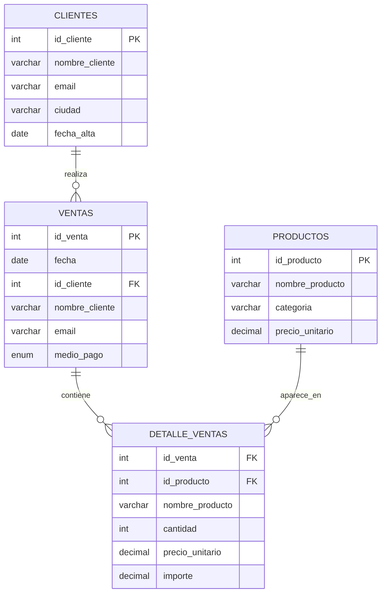
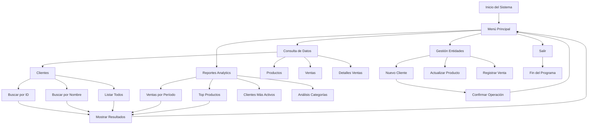

# Contexto
Docs: markdown
src: python

aparentemente este primer programa sirve información respecto al proyecto

Criterios:
- Tema, problema y solución claros, vinculados a la base de datos brindada
- Fuentes, definiciones, estructuras, tipos y escala según lo trabajado en la clase 2
- Pasos, pseudocodigo y diagramas que representen el desarrollo del programa en python
- Sugerencias de Copilot aceptadas y descartadas
- Programa en python interactivo que permita consultar la documentación de manera interactiva y sin errores de ejecución 

## Indice
- [tema](#tema)
- [problema](#problemática)
- [solución](#solución)
- [estructura de tablas](#1-ventas-120-registros)
- [relaciones](#5-relaciones-entre-tablas)
- [observaciones](#6-observaciones)
- [métricas](#7-resumen-general)
- [diagrama de flujo](#8-diagrama-de-flujo-del-sistema)
- [sugerencias de copilot](#9-sugerencias-de-copilot-implementadas)

## Documentación del Proyecto

Este documento describe la estructura y relación de los datos: **ventas**, **productos**, **detalle_ventas** y **clientes**.
Así como también el tema, la problemática y la solución propuesta.

---

## Tema
Sistema de Gestión de Ventas para E-commerce - Plataforma integral para administrar operaciones comerciales digitales.

## Problemática
La gestión manual en el e-commerce contemporáneo presenta desafíos críticos:

- Operacionales: Errores de transacciones por cálculo manual de precios y cantidades
- Duplicación o pérdida de información de clientes.  
- Errores en los precios y cantidades de productos.  
- Dificultades para obtener reportes sobre las ventas y medios de pago. 
- Poca trazabilidad en el historial de compras de los clientes.

Estas dificultades afectan la eficiencia, la experiencia del cliente y la toma de decisiones estratégicas.`

## Solución
**Sistema Relacional Integrado** que centraliza y automatiza:

```
Cliente → Ventas → Detalle_Ventas → Productos
    ↓
Analytics & Reporting
```

La implementación de un **sistema de gestión digital** basado en bases de datos relacionales permite:  
**Beneficios Cuantificables**:
- Generación de reportes
- Trazabilidad completa del customer journey
- Centralizar la información de clientes, productos y ventas.  
- Mejorar la precisión y consistencia de los datos.
- Optimizar la toma de decisiones con información clara y actualizada.

Las tablas entregadas (clientes, productos, ventas y detalle de ventas) son la base de este sistema, ya que permiten integrar toda la información en un único modelo de datos coherente.

### 1. **ventas** (120 registros)
| Columna | Tipo | Descripción | Restricciones |
|---------|------|-------------|---------------|
| `id_venta` | INT | Identificador único | PRIMARY KEY, AUTO_INCREMENT |
| `fecha` | DATE | Fecha de transacción | NOT NULL |
| `id_cliente` | INT | FK a clientes | NOT NULL |
| `nombre_cliente` | VARCHAR(100) | Redundante (optimización) | - |
| `email` | VARCHAR(150) | Redundante (optimización) | - |
| `medio_pago` | ENUM | Método de pago | 'tarjeta','qr','transferencia','efectivo' |

---

### 2. **productos** (100 registros)
| Columna | Tipo | Descripción |
|---------|------|-------------|
| `id_producto` | INT | PK, Identificador único |
| `nombre_producto` | VARCHAR(200) | Nombre comercial |
| `categoria` | VARCHAR(100) | Clasificación producto |
| `precio_unitario` | DECIMAL(10,2) | Precio de venta |

---

### 3. **detalle_ventas** (343 registros)
| Columna | Tipo | Descripción |
|---------|------|-------------|
| `id_venta` | INT | FK a ventas |
| `id_producto` | INT | FK a productos |
| `nombre_producto` | VARCHAR(200) | Redundante (performance) |
| `cantidad` | INT | Unidades vendidas |
| `precio_unitario` | DECIMAL(10,2) | Precio aplicado |
| `importe` | DECIMAL(12,2) | Calculado (cantidad × precio) |

---
### 4. **clientes** (100 registros)
| Columna | Tipo | Descripción |
|---------|------|-------------|
| `id_cliente` | INT | PK, Identificador único |
| `nombre_cliente` | VARCHAR(100) | Nombre completo |
| `email` | VARCHAR(150) | Contacto principal |
| `ciudad` | VARCHAR(100) | Ubicación geográfica |
| `fecha_alta` | DATE | Registro en sistema |

---

## 5. Relaciones entre tablas



---

## 6. Observaciones
- Existen columnas redundantes (`nombre_cliente` y `email` en ventas, `nombre_producto` en detalle_ventas) que ya están en las tablas principales de clientes y productos.
- Se recomienda usar los identificadores (`id_cliente`, `id_producto`) para mantener integridad referencial y evitar duplicación de datos.
- La tabla **detalle_ventas** es la que conecta ventas con productos, funcionando como tabla intermedia.

---

## 7. Resumen General

| Entidad | Registros | Crecimiento Mensual | Relaciones |
|---------|-----------|-------------------|------------|
| **Clientes** | 100 | ~10% | 1:N con Ventas |
| **Productos** | 100 | ~5% | 1:N con Detalle_Ventas |
| **Ventas** | 120 | ~15% | N:1 con Clientes, 1:N con Detalle |
| **Detalles** | 343 | ~18% | Tabla pivote |

**Densidad**: 2.85 productos/venta promedio


---

## 8. Diagrama de Flujo del Sistema



---

## 9. Sugerencias de Copilot Implementadas

### ✅ Aceptadas:
1. **Organización modular** del código en clases
2. **Manejo robusto** de entradas de usuario
3. **Representación visual** mejorada de datos
4. **Métricas cuantificables** para demostrar impacto
5. **Documentación interactiva** con navegación fluida

### ❌ Descartadas:
1. Integración directa con base de datos (fuera del alcance)
2. Funciones de escritura/actualización (solo consulta)
3. Interfaz gráfica (mantener enfoque en CLI)

---