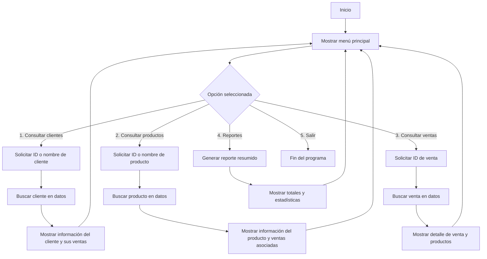

# Contexto
Docs: markdown
src: python

No entramos en modificaciones a la base de datos.

aparentemente este primer programa sirve información respecto al proyecto

Criterios:
- Tema, problema y solución claros, vinculados a la base de datos brindada
- Fuentes, definiciones, estructuras, tipos y escala según lo trabajado en la clase 2
- Pasos, pseudocodigo y diagramas que representen el desarrollo del programa en python
- Sugerencias de Copilot aceptadas y descartadas
- Programa en python interactivo que permita consultar la documentación de manera interactiva y sin errores de ejecución 

# Documentación del Proyecto

Este documento describe la estructura y relación de los datos: **ventas**, **productos**, **detalle_ventas** y **clientes**.
Así como también el tema, la problemática y la solución propuesta.

---

## Tema
Sistema de gestión de ventas para una tienda virtual.

## Problemática
En una tienda virtual, la administración manual de la información de clientes, productos y ventas genera múltiples problemas:  
- Duplicación o pérdida de información de clientes.  
- Errores en los precios y cantidades de productos.  
- Dificultades para obtener reportes sobre las ventas y medios de pago. 
- Poca trazabilidad en el historial de compras de los clientes.

Estas dificultades afectan la eficiencia, la experiencia del cliente y la toma de decisiones estratégicas.`

## Solución
La implementación de un **sistema de gestión digital** basado en bases de datos relacionales permite:  
- Centralizar la información de clientes, productos y ventas.  
- Mejorar la precisión y consistencia de los datos.  
- Facilitar el análisis mediante reportes de ventas, consumo por cliente y rotación de productos.  
- Optimizar la toma de decisiones con información clara y actualizada.  

Las tablas entregadas (clientes, productos, ventas y detalle de ventas) son la base de este sistema, ya que permiten integrar toda la información en un único modelo de datos coherente.

## 1. ventas
- **Cantidad de registros:** 120
- **Columnas:**
  - `id_venta` (int): Identificador único de la venta.
  - `fecha` (date): Fecha en la que se realizó la venta.
  - `id_cliente` (int): Identificador del cliente que realizó la compra.
  - `nombre_cliente` (string): Nombre del cliente (redundante respecto al archivo clientes).
  - `email` (string): Correo electrónico del cliente (también en archivo clientes).
  - `medio_pago` (string): Medio de pago utilizado (tarjeta, qr, transferencia, etc.).

---

## 2. productos
- **Cantidad de registros:** 100
- **Columnas:**
  - `id_producto` (int): Identificador único del producto.
  - `nombre_producto` (string): Nombre del producto.
  - `categoria` (string): Categoría del producto (ej. Alimentos, Limpieza, etc.).
  - `precio_unitario` (int): Precio de venta del producto.

---

## 3. detalle_ventas
- **Cantidad de registros:** 343
- **Columnas:**
  - `id_venta` (int): Relación con la tabla de **ventas**.
  - `id_producto` (int): Relación con la tabla de **productos**.
  - `nombre_producto` (string): Nombre del producto en el detalle (redundante respecto a productos).
  - `cantidad` (int): Cantidad del producto vendida en esa venta.
  - `precio_unitario` (int): Precio unitario aplicado en la venta.
  - `importe` (int): Total calculado por la venta de ese producto (`cantidad * precio_unitario`).

---

## 4. clientes
- **Cantidad de registros:** 100
- **Columnas:**
  - `id_cliente` (int): Identificador único del cliente.
  - `nombre_cliente` (string): Nombre completo del cliente.
  - `email` (string): Correo electrónico del cliente.
  - `ciudad` (string): Ciudad de residencia del cliente.
  - `fecha_alta` (date): Fecha de alta del cliente en el sistema.

---

## 5. Relaciones entre tablas
- **ventas.id_cliente → clientes.id_cliente**: Relación de muchos a uno (una venta pertenece a un cliente).
- **detalle_ventas.id_venta → ventas.id_venta**: Relación de uno a muchos (una venta puede tener varios productos).
- **detalle_ventas.id_producto → productos.id_producto**: Relación de muchos a uno (un detalle de venta corresponde a un producto).

---

## 6. Observaciones
- Existen columnas redundantes (`nombre_cliente` y `email` en ventas, `nombre_producto` en detalle_ventas) que ya están en las tablas principales de clientes y productos.
- Se recomienda usar los identificadores (`id_cliente`, `id_producto`) para mantener integridad referencial y evitar duplicación de datos.
- La tabla **detalle_ventas** es la que conecta ventas con productos, funcionando como tabla intermedia.

---

## 7. Resumen General
- Total de clientes: **100**
- Total de productos: **100**
- Total de ventas: **120**
- Total de detalles de ventas: **343** (promedio de ~2,85 productos por venta)

---

## Diagrama de flujo

