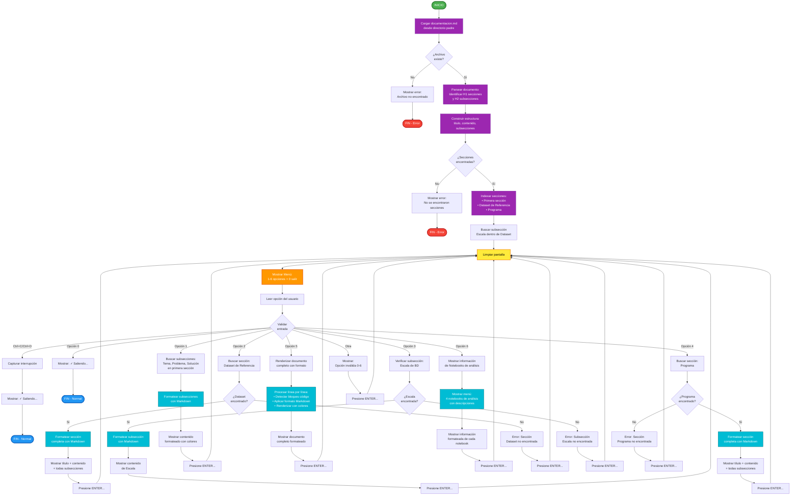

# Diagrama de Flujo del Visor Interactivo

## Ver Diagrama de Flujo en Línea

**Visor de Documentación Interactivo:**

👉 **[Abrir Diagrama en MermaidChart](https://www.mermaidchart.com/d/47deed55-555a-49b4-b045-2f80363d53e5)**

Este diagrama muestra el flujo completo del programa `interactive_menu/main.py`, incluyendo:
- Carga y parseo del archivo `documentation.md`
- Navegación por menú interactivo
- Búsqueda de secciones H1 y subsecciones H2
- Renderizado con formato Markdown y colores ANSI
- Manejo de errores y validaciones

---

## Archivo Local

El código fuente del diagrama también está disponible localmente:

```
interactive_menu/docs/flowchart.mmd
```

